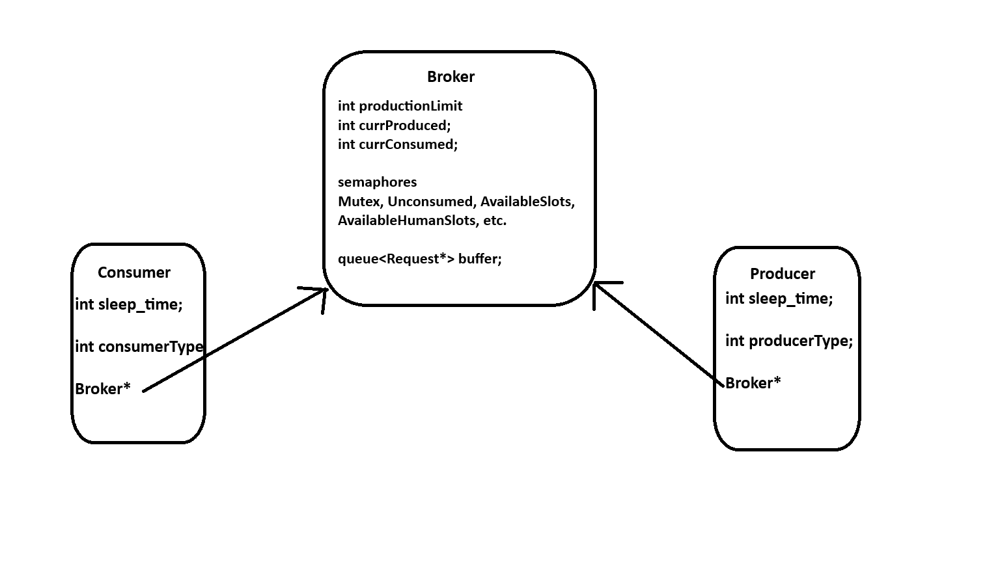

Description

This program serves to emulate how a ride share service might handle multiple parties accessing a shared piece of data. 
Producer threads act as users attempting to request a ride from either a human or autonomous driver.
This request would be stored by the service in a structure acting as a broker.
Consumer threads are notified of existing requests and remove them from the broker.

To synchronize muliple threads running I used semaphores which will create a critical section and ensure the integrity of the broker buffer and counts.



Challenges
 
* Ensure that when a critical piece of memory is accessed or manipulated, no other thread may have access to it.
* Bounded waiting enforced by semaphores potentially leads to deadlocks

Use

The included Makefile allows anyone with atleast C++11 to build an executable.
Arguments for this program include:

* -n number of total requests to produce
* -h nanoseconds for human producer thread to sleep
* -r nanoseconds for robot producer thread to sleep
* -c nanoseconds for Cost focused Algorithm thread to sleep
* -f nanoseconds for Fast focused Algorithm thread to sleep

* all arguments have default values in the case they are not provided

Example: ./rideshare -n 50 -h 2 -r 1 -c 3 -f 3


Output
```
Broker: 0 HDR + 1 RDR = 1. Added Robot Driver Request. Produced: 0 HDR + 1 RDR = 1 in 0.000 s.
Broker: 0 HDR + 0 RDR = 0. CostAlgo Dispatcher consumed Robot Driver Request.  CostAlgo Dispatcher totals: 0 HDR + 1 RDR = 1 consumed in 0.000 s.
Broker: 1 HDR + 0 RDR = 1. Added Human Driver Request. Produced: 1 HDR + 1 RDR = 2 in 0.001 s.
Broker: 0 HDR + 0 RDR = 0. FastAlgo Dispatcher consumed Human Driver Request.  FastAlgo Dispatcher totals: 1 HDR + 0 RDR = 1 consumed in 0.001 s.
Broker: 0 HDR + 1 RDR = 1. Added Robot Driver Request. Produced: 1 HDR + 2 RDR = 3 in 0.001 s.
Broker: 0 HDR + 2 RDR = 2. Added Robot Driver Request. Produced: 1 HDR + 3 RDR = 4 in 0.002 s.
Broker: 1 HDR + 2 RDR = 3. Added Human Driver Request. Produced: 2 HDR + 3 RDR = 5 in 0.003 s.
Broker: 1 HDR + 1 RDR = 2. CostAlgo Dispatcher consumed Robot Driver Request.  CostAlgo Dispatcher totals: 0 HDR + 2 RDR = 2 consumed in 0.003 s.
Broker: 1 HDR + 2 RDR = 3. Added Robot Driver Request. Produced: 2 HDR + 4 RDR = 6 in 0.003 s.
Broker: 1 HDR + 1 RDR = 2. FastAlgo Dispatcher consumed Robot Driver Request.  FastAlgo Dispatcher totals: 1 HDR + 1 RDR = 2 consumed in 0.004 s.
Broker: 1 HDR + 2 RDR = 3. Added Robot Driver Request. Produced: 2 HDR + 5 RDR = 7 in 0.004 s.
Broker: 2 HDR + 2 RDR = 4. Added Human Driver Request. Produced: 3 HDR + 5 RDR = 8 in 0.005 s.
Broker: 2 HDR + 3 RDR = 5. Added Robot Driver Request. Produced: 3 HDR + 6 RDR = 9 in 0.005 s.
Broker: 1 HDR + 3 RDR = 4. CostAlgo Dispatcher consumed Human Driver Request.  CostAlgo Dispatcher totals: 1 HDR + 2 RDR = 3 consumed in 0.006 s.
Broker: 1 HDR + 4 RDR = 5. Added Robot Driver Request. Produced: 3 HDR + 7 RDR = 10 in 0.007 s.
Broker: 1 HDR + 3 RDR = 4. FastAlgo Dispatcher consumed Robot Driver Request.  FastAlgo Dispatcher totals: 1 HDR + 2 RDR = 3 consumed in 0.007 s.
Broker: 2 HDR + 3 RDR = 5. Added Human Driver Request. Produced: 4 HDR + 7 RDR = 11 in 0.007 s.
Broker: 2 HDR + 4 RDR = 6. Added Robot Driver Request. Produced: 4 HDR + 8 RDR = 12 in 0.008 s.
Broker: 2 HDR + 5 RDR = 7. Added Robot Driver Request. Produced: 4 HDR + 9 RDR = 13 in 0.009 s.
Broker: 2 HDR + 4 RDR = 6. CostAlgo Dispatcher consumed Robot Driver Request.  CostAlgo Dispatcher totals: 1 HDR + 3 RDR = 4 consumed in 0.009 s.
Broker: 3 HDR + 4 RDR = 7. Added Human Driver Request. Produced: 5 HDR + 9 RDR = 14 in 0.009 s.
Broker: 3 HDR + 5 RDR = 8. Added Robot Driver Request. Produced: 5 HDR + 10 RDR = 15 in 0.010 s.
Broker: 2 HDR + 5 RDR = 7. FastAlgo Dispatcher consumed Human Driver Request.  FastAlgo Dispatcher totals: 2 HDR + 2 RDR = 4 consumed in 0.010 s.
Broker: 2 HDR + 6 RDR = 8. Added Robot Driver Request. Produced: 5 HDR + 11 RDR = 16 in 0.011 s.
Broker: 3 HDR + 6 RDR = 9. Added Human Driver Request. Produced: 6 HDR + 11 RDR = 17 in 0.011 s.
Broker: 3 HDR + 7 RDR = 10. Added Robot Driver Request. Produced: 6 HDR + 12 RDR = 18 in 0.012 s.
Broker: 3 HDR + 6 RDR = 9. CostAlgo Dispatcher consumed Robot Driver Request.  CostAlgo Dispatcher totals: 1 HDR + 4 RDR = 5 consumed in 0.012 s.
Broker: 3 HDR + 7 RDR = 10. Added Robot Driver Request. Produced: 6 HDR + 13 RDR = 19 in 0.013 s.
Broker: 3 HDR + 6 RDR = 9. FastAlgo Dispatcher consumed Robot Driver Request.  FastAlgo Dispatcher totals: 2 HDR + 3 RDR = 5 consumed in 0.013 s.
Broker: 4 HDR + 6 RDR = 10. Added Human Driver Request. Produced: 7 HDR + 13 RDR = 20 in 0.014 s.
Broker: 4 HDR + 7 RDR = 11. Added Robot Driver Request. Produced: 7 HDR + 14 RDR = 21 in 0.014 s.
Broker: 4 HDR + 8 RDR = 12. Added Robot Driver Request. Produced: 7 HDR + 15 RDR = 22 in 0.015 s.
Broker: 3 HDR + 8 RDR = 11. CostAlgo Dispatcher consumed Human Driver Request.  CostAlgo Dispatcher totals: 2 HDR + 4 RDR = 6 consumed in 0.015 s.
Broker: 4 HDR + 8 RDR = 12. Added Human Driver Request. Produced: 8 HDR + 15 RDR = 23 in 0.016 s.
Broker: 4 HDR + 7 RDR = 11. FastAlgo Dispatcher consumed Robot Driver Request.  FastAlgo Dispatcher totals: 2 HDR + 4 RDR = 6 consumed in 0.016 s.
Broker: 4 HDR + 8 RDR = 12. Added Robot Driver Request. Produced: 8 HDR + 16 RDR = 24 in 0.017 s.
Broker: 4 HDR + 7 RDR = 11. CostAlgo Dispatcher consumed Robot Driver Request.  CostAlgo Dispatcher totals: 2 HDR + 5 RDR = 7 consumed in 0.019 s.
Broker: 4 HDR + 8 RDR = 12. Added Robot Driver Request. Produced: 8 HDR + 17 RDR = 25 in 0.019 s.
Broker: 3 HDR + 8 RDR = 11. FastAlgo Dispatcher consumed Human Driver Request.  FastAlgo Dispatcher totals: 3 HDR + 4 RDR = 7 consumed in 0.020 s.
Broker: 4 HDR + 8 RDR = 12. Added Human Driver Request. Produced: 9 HDR + 17 RDR = 26 in 0.020 s.
Broker: 4 HDR + 7 RDR = 11. CostAlgo Dispatcher consumed Robot Driver Request.  CostAlgo Dispatcher totals: 2 HDR + 6 RDR = 8 consumed in 0.022 s.
Broker: 4 HDR + 8 RDR = 12. Added Robot Driver Request. Produced: 9 HDR + 18 RDR = 27 in 0.022 s.
Broker: 4 HDR + 7 RDR = 11. FastAlgo Dispatcher consumed Robot Driver Request.  FastAlgo Dispatcher totals: 3 HDR + 5 RDR = 8 consumed in 0.023 s.
Broker: 4 HDR + 8 RDR = 12. Added Robot Driver Request. Produced: 9 HDR + 19 RDR = 28 in 0.023 s.
Broker: 3 HDR + 8 RDR = 11. CostAlgo Dispatcher consumed Human Driver Request.  CostAlgo Dispatcher totals: 3 HDR + 6 RDR = 9 consumed in 0.025 s.
Broker: 4 HDR + 8 RDR = 12. Added Human Driver Request. Produced: 10 HDR + 19 RDR = 29 in 0.025 s.
Broker: 4 HDR + 7 RDR = 11. FastAlgo Dispatcher consumed Robot Driver Request.  FastAlgo Dispatcher totals: 3 HDR + 6 RDR = 9 consumed in 0.026 s.
Broker: 4 HDR + 8 RDR = 12. Added Robot Driver Request. Produced: 10 HDR + 20 RDR = 30 in 0.026 s.
Broker: 4 HDR + 7 RDR = 11. CostAlgo Dispatcher consumed Robot Driver Request.  CostAlgo Dispatcher totals: 3 HDR + 7 RDR = 10 consumed in 0.028 s.
Broker: 4 HDR + 8 RDR = 12. Added Robot Driver Request. Produced: 10 HDR + 21 RDR = 31 in 0.028 s.
Broker: 3 HDR + 8 RDR = 11. FastAlgo Dispatcher consumed Human Driver Request.  FastAlgo Dispatcher totals: 4 HDR + 6 RDR = 10 consumed in 0.029 s.
Broker: 4 HDR + 8 RDR = 12. Added Human Driver Request. Produced: 11 HDR + 21 RDR = 32 in 0.029 s.
Broker: 4 HDR + 7 RDR = 11. CostAlgo Dispatcher consumed Robot Driver Request.  CostAlgo Dispatcher totals: 3 HDR + 8 RDR = 11 consumed in 0.031 s.
Broker: 4 HDR + 8 RDR = 12. Added Robot Driver Request. Produced: 11 HDR + 22 RDR = 33 in 0.031 s.
Broker: 4 HDR + 7 RDR = 11. FastAlgo Dispatcher consumed Robot Driver Request.  FastAlgo Dispatcher totals: 4 HDR + 7 RDR = 11 consumed in 0.032 s.
Broker: 4 HDR + 8 RDR = 12. Added Robot Driver Request. Produced: 11 HDR + 23 RDR = 34 in 0.032 s.
Broker: 3 HDR + 8 RDR = 11. CostAlgo Dispatcher consumed Human Driver Request.  CostAlgo Dispatcher totals: 4 HDR + 8 RDR = 12 consumed in 0.034 s.
Broker: 4 HDR + 8 RDR = 12. Added Human Driver Request. Produced: 12 HDR + 23 RDR = 35 in 0.034 s.
Broker: 4 HDR + 7 RDR = 11. FastAlgo Dispatcher consumed Robot Driver Request.  FastAlgo Dispatcher totals: 4 HDR + 8 RDR = 12 consumed in 0.035 s.
Broker: 4 HDR + 8 RDR = 12. Added Robot Driver Request. Produced: 12 HDR + 24 RDR = 36 in 0.035 s.
Broker: 4 HDR + 7 RDR = 11. CostAlgo Dispatcher consumed Robot Driver Request.  CostAlgo Dispatcher totals: 4 HDR + 9 RDR = 13 consumed in 0.037 s.
Broker: 4 HDR + 8 RDR = 12. Added Robot Driver Request. Produced: 12 HDR + 25 RDR = 37 in 0.037 s.
Broker: 3 HDR + 8 RDR = 11. FastAlgo Dispatcher consumed Human Driver Request.  FastAlgo Dispatcher totals: 5 HDR + 8 RDR = 13 consumed in 0.038 s.
Broker: 4 HDR + 8 RDR = 12. Added Human Driver Request. Produced: 13 HDR + 25 RDR = 38 in 0.038 s.
Broker: 4 HDR + 7 RDR = 11. CostAlgo Dispatcher consumed Robot Driver Request.  CostAlgo Dispatcher totals: 4 HDR + 10 RDR = 14 consumed in 0.040 s.
Broker: 4 HDR + 8 RDR = 12. Added Robot Driver Request. Produced: 13 HDR + 26 RDR = 39 in 0.040 s.
Broker: 4 HDR + 7 RDR = 11. FastAlgo Dispatcher consumed Robot Driver Request.  FastAlgo Dispatcher totals: 5 HDR + 9 RDR = 14 consumed in 0.041 s.
Broker: 4 HDR + 8 RDR = 12. Added Robot Driver Request. Produced: 13 HDR + 27 RDR = 40 in 0.041 s.
Broker: 3 HDR + 8 RDR = 11. CostAlgo Dispatcher consumed Human Driver Request.  CostAlgo Dispatcher totals: 5 HDR + 10 RDR = 15 consumed in 0.043 s.
Broker: 4 HDR + 8 RDR = 12. Added Human Driver Request. Produced: 14 HDR + 27 RDR = 41 in 0.043 s.
Broker: 4 HDR + 7 RDR = 11. FastAlgo Dispatcher consumed Robot Driver Request.  FastAlgo Dispatcher totals: 5 HDR + 10 RDR = 15 consumed in 0.044 s.
Broker: 4 HDR + 8 RDR = 12. Added Robot Driver Request. Produced: 14 HDR + 28 RDR = 42 in 0.044 s.
Broker: 4 HDR + 7 RDR = 11. CostAlgo Dispatcher consumed Robot Driver Request.  CostAlgo Dispatcher totals: 5 HDR + 11 RDR = 16 consumed in 0.047 s.
Broker: 4 HDR + 8 RDR = 12. Added Robot Driver Request. Produced: 14 HDR + 29 RDR = 43 in 0.047 s.
Broker: 3 HDR + 8 RDR = 11. FastAlgo Dispatcher consumed Human Driver Request.  FastAlgo Dispatcher totals: 6 HDR + 10 RDR = 16 consumed in 0.047 s.
Broker: 4 HDR + 8 RDR = 12. Added Human Driver Request. Produced: 15 HDR + 29 RDR = 44 in 0.047 s.
Broker: 4 HDR + 7 RDR = 11. CostAlgo Dispatcher consumed Robot Driver Request.  CostAlgo Dispatcher totals: 5 HDR + 12 RDR = 17 consumed in 0.050 s.
Broker: 4 HDR + 8 RDR = 12. Added Robot Driver Request. Produced: 15 HDR + 30 RDR = 45 in 0.050 s.
Broker: 4 HDR + 7 RDR = 11. FastAlgo Dispatcher consumed Robot Driver Request.  FastAlgo Dispatcher totals: 6 HDR + 11 RDR = 17 consumed in 0.051 s.
Broker: 4 HDR + 8 RDR = 12. Added Robot Driver Request. Produced: 15 HDR + 31 RDR = 46 in 0.051 s.
Broker: 3 HDR + 8 RDR = 11. CostAlgo Dispatcher consumed Human Driver Request.  CostAlgo Dispatcher totals: 6 HDR + 12 RDR = 18 consumed in 0.053 s.
Broker: 4 HDR + 8 RDR = 12. Added Human Driver Request. Produced: 16 HDR + 31 RDR = 47 in 0.053 s.
Broker: 4 HDR + 7 RDR = 11. FastAlgo Dispatcher consumed Robot Driver Request.  FastAlgo Dispatcher totals: 6 HDR + 12 RDR = 18 consumed in 0.054 s.
Broker: 4 HDR + 8 RDR = 12. Added Robot Driver Request. Produced: 16 HDR + 32 RDR = 48 in 0.054 s.
Broker: 4 HDR + 7 RDR = 11. CostAlgo Dispatcher consumed Robot Driver Request.  CostAlgo Dispatcher totals: 6 HDR + 13 RDR = 19 consumed in 0.056 s.
Broker: 4 HDR + 8 RDR = 12. Added Robot Driver Request. Produced: 16 HDR + 33 RDR = 49 in 0.056 s.
Broker: 3 HDR + 8 RDR = 11. FastAlgo Dispatcher consumed Human Driver Request.  FastAlgo Dispatcher totals: 7 HDR + 12 RDR = 19 consumed in 0.057 s.
Broker: 4 HDR + 8 RDR = 12. Added Human Driver Request. Produced: 17 HDR + 33 RDR = 50 in 0.057 s.
Broker: 4 HDR + 7 RDR = 11. CostAlgo Dispatcher consumed Robot Driver Request.  CostAlgo Dispatcher totals: 6 HDR + 14 RDR = 20 consumed in 0.059 s.
Broker: 4 HDR + 6 RDR = 10. FastAlgo Dispatcher consumed Robot Driver Request.  FastAlgo Dispatcher totals: 7 HDR + 13 RDR = 20 consumed in 0.060 s.
Broker: 3 HDR + 6 RDR = 9. CostAlgo Dispatcher consumed Human Driver Request.  CostAlgo Dispatcher totals: 7 HDR + 14 RDR = 21 consumed in 0.062 s.
Broker: 3 HDR + 5 RDR = 8. FastAlgo Dispatcher consumed Robot Driver Request.  FastAlgo Dispatcher totals: 7 HDR + 14 RDR = 21 consumed in 0.063 s.
Broker: 3 HDR + 4 RDR = 7. CostAlgo Dispatcher consumed Robot Driver Request.  CostAlgo Dispatcher totals: 7 HDR + 15 RDR = 22 consumed in 0.065 s.
Broker: 2 HDR + 4 RDR = 6. FastAlgo Dispatcher consumed Human Driver Request.  FastAlgo Dispatcher totals: 8 HDR + 14 RDR = 22 consumed in 0.066 s.
Broker: 2 HDR + 3 RDR = 5. CostAlgo Dispatcher consumed Robot Driver Request.  CostAlgo Dispatcher totals: 7 HDR + 16 RDR = 23 consumed in 0.068 s.
Broker: 2 HDR + 2 RDR = 4. FastAlgo Dispatcher consumed Robot Driver Request.  FastAlgo Dispatcher totals: 8 HDR + 15 RDR = 23 consumed in 0.069 s.
Broker: 1 HDR + 2 RDR = 3. CostAlgo Dispatcher consumed Human Driver Request.  CostAlgo Dispatcher totals: 8 HDR + 16 RDR = 24 consumed in 0.071 s.
Broker: 1 HDR + 1 RDR = 2. FastAlgo Dispatcher consumed Robot Driver Request.  FastAlgo Dispatcher totals: 8 HDR + 16 RDR = 24 consumed in 0.072 s.
Broker: 1 HDR + 0 RDR = 1. CostAlgo Dispatcher consumed Robot Driver Request.  CostAlgo Dispatcher totals: 8 HDR + 17 RDR = 25 consumed in 0.074 s.
Broker: 0 HDR + 0 RDR = 0. FastAlgo Dispatcher consumed Human Driver Request.  FastAlgo Dispatcher totals: 9 HDR + 16 RDR = 25 consumed in 0.075 s.

REQUEST REPORT
----------------------------------------
Human Driver Request producer generated 17 requests
Robot Driver Request producer generated 33 requests
CostAlgo Dispatcher consumed 8 HDR + 17 RDR = 25 total
FastAlgo Dispatcher consumed 9 HDR + 16 RDR = 25 total
Elapsed time 0.078 s
```
